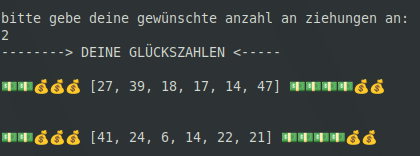
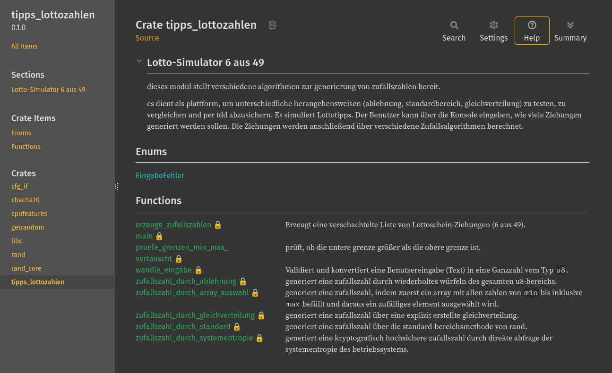

---
---
# ........ eigenständiges übungsprojekt ........
---
---
# Lotto-Simulator 6 aus 49

Dieses Projekt ist ein eigenständiges Übungsprojekt, das **vollständig nach den Prinzipien des Test-Driven Development (TDD) entwickelt** wurde. Es dient zur praktischen Vertiefung von Rust-Konzepten wie Pattern Matching, Fehlerbehandlung und Makros.
Das Programm simuliert Lottotipps über die Konsole und fungiert als Test- und Vergleichsplattform für verschiedene mathematische sowie systemnahe Zufallsalgorithmen, die durch eine umfassende Testsuite abgesichert sind.

---
## Vorschau


---
## Funktionen

* Konsolenbasierte Abfrage der gewünschten Ziehungsanzahl mit robuster Eingabevalidierung.
* Erkennung und Behandlung von fehlerhaften Eingaben (leere Eingaben, negative Werte, ungültige Zeichen).
* Dynamische Kombination von 5 verschiedenen Zufallsverfahren zur Erzeugung der Gewinnzahlen.
* Konsequente Filterung von Duplikaten innerhalb einer Ziehung.

---
## Implementierte Zufallsalgorithmen

Zur Generierung der 6 aus 49 Gewinnzahlen greift das Programm pro Zahl zufällig auf eines der folgenden Verfahren zurück:

1. Ablehnungsverfahren (Rejection Sampling aus dem vollen u8-Bereich)
2. Standard-Bereichsmethode der rand-Bibliothek
3. Mathematische Gleichverteilung (Uniform-Distribution)
4. Array-basierte Zufallsauswahl aus einer vorbereiteten Zahlenliste
5. Kryptografisch sichere Zufallszahlengenerierung direkt über die Systementropie (getrandom)

---
## TDD und Testabdeckung  

Da das Projekt strikt per TDD entwickelt wurde, ist die korrekte Funktionsweise aller Komponenten durch automatisierte Tests garantiert. Über ein maßgeschneidertes Test-Makro werden alle fünf Zufallsalgorithmen parallel auf dieselben mathematischen Randbedingungen (wie korrekte Bereichsgrenzen und das Auslösen von Panics bei Fehlkonfigurationen) geprüft.

---
## Voraussetzungen

Das Projekt benötigt die Rust-Toolchain (Cargo) und nutzt externe Abhängigkeiten für die Zufallsgenerierung (rand, getrandom).

---
## Nutzung

### Anwendung starten
Kompiliert das Programm und startet die interaktive Konsolenabfrage:
```bash
cargo run
```

### Tests ausführen
Führt die TDD-Testsuite für alle Zufallsalgorithmen sowie die Validierungstests aus:
```bash
cargo test
```

### Dokumentation generieren
Erstellt die lokale HTML-Dokumentation basierend auf den im Code hinterlegten Doku-Kommentaren und öffnet diese im Browser:
```bash
cargo doc --open
```


